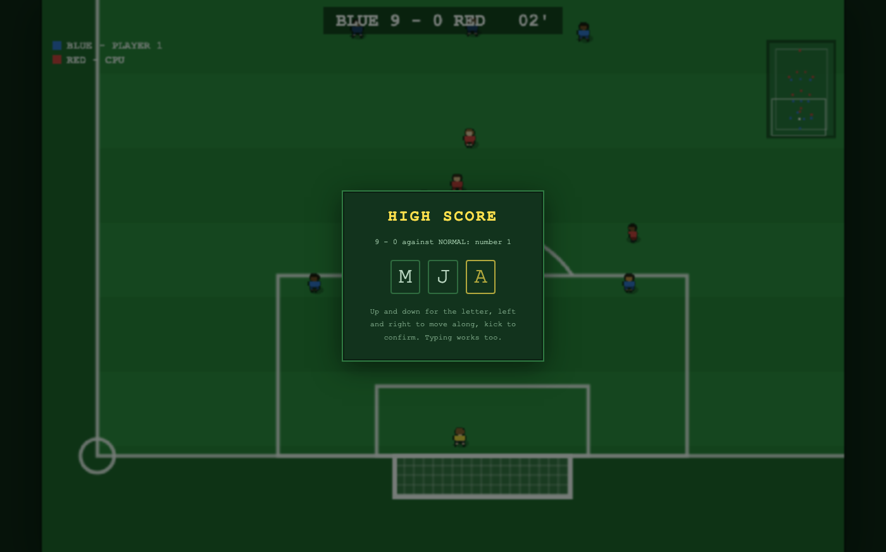

# WebSoccer

Arcade football in the browser, in the spirit of the 16-bit classics: a
vertically scrolling pitch, tiny players, one button, and aftertouch to bend the
ball. **1 player against the CPU**, **2 players on one keyboard**, or **online**
with a four-character room code.

No dependencies, no build step. HTML, CSS and JavaScript exactly as the browser
receives them.

**[Play it here](https://markclausing.github.io/websoccer/)**


## Getting started

```bash
git clone https://github.com/markclausing/websoccer.git
cd websoccer
npm start
```

Then open http://localhost:5173/ — that is all. There is no `npm install`; there
are no packages to install. That one server serves the page, pairs up online
matches and keeps the shared high score board.

A different port, playing over your network, troubleshooting:
[INSTALL.md](INSTALL.md). Want to help build it?
[CONTRIBUTING.md](CONTRIBUTING.md).

## Controls

|               | Player 1 (blue) | Player 2 (red) |
| ------------- | --------------- | -------------- |
| Move          | `W A S D`       | Arrow keys     |
| Kick / slide  | `Space`         | `Enter`        |
| Switch player | `Q`             | `R Shift`      |
| Pause         | `Esc`           | (not online)   |

**Every key can be changed in the menu** — click one and press what you want, or
take a preset. Gamepads work. On a phone you get a thumbstick and two buttons
instead, and the game asks you to turn it sideways; they feed the same input as
the keyboard, so nothing else in the game knows the difference. On Android it
goes fullscreen at kickoff; on an iPhone, Safari cannot, so use Share → Add to
Home Screen and it opens as its own app.


How it plays:

- **Tap** for a pass along the ground, **hold** for something harder and higher.
  The bar under your player shows the power.
- **Passes are helped along** — aim roughly at a team-mate and the ball bends
  towards him — while a **shot is never touched**. What decides which is which is
  not how hard you hit it but where you point: if your aim crosses the goal line
  inside the posts, it is an attempt on goal and the assist keeps out of it.
- **Aftertouch**: keep steering after the kick. Sideways bends it, forwards lifts
  it, backwards makes it dip.
- The button **without the ball** is a slide tackle.
- You control whoever is nearest the ball; the **switch button steps to the next
  man out**, so pressing it repeatedly works outwards.

There is a **commentator**, and he is made of filters rather than recordings:
formant synthesis, which is roughly what the speech chips of the era did. He
speaks only for a goal, a save or a long run with the ball, never twice within
six seconds, and there is a switch in the menu for when you have had enough.

There are goals, throw-ins, corners, goal kicks, half time, a final whistle and
**offside** (switchable). No fouls: slide tackles are free, deliberately, like
the originals. Four things follow the real rules rather than arcade convention,
because they kept spoiling matches: at any restart the opposition **stays off the
ball** until it has been touched; at a kickoff everyone stands **in their own
half**; a **keeper holding the ball in his box** has about six seconds before
anyone may challenge; and the keeper makes his own saves — you take over the
moment he has it.

## Line-ups


Under **Line-up** there is a small pitch with your eleven on it. Take one of five
shapes — 4-3-3, 4-4-2 diamond, 4-4-2 flat, 3-5-2, 5-3-2 — or drag the players
where you want them. Your own goal is at the bottom, so dragging a man upwards
pushes him forward. Both sides can be set; in a one player match the red buttons
are the CPU's shape.

Nobody is labelled a defender or a striker. **Where you put a player is what he
becomes**, read off how far up the pitch he stands: the back band tracks all the
way back, a holding midfielder most of the way, a hanging ten barely at all. Your
line-up is remembered, and online each side plays its own.

A warning, since it is measurable: the match is balanced around the 4-3-3, and
partly balanced by being *stuck* — with both sides playing it the ball spends 93%
of the match in the middle third. Other shapes open the game up and CPU against
CPU the scorelines run away. See the note in `src/game/formations.js`.

## High scores



Beat the CPU and you are asked for three letters, the way a cabinet asks: stick
up and down for the letter, left and right to move, kick to confirm. Typing works
too. Ten per difficulty, ranked by margin, then goals, then who got there first.
A draw counts; a defeat never does.

By default the table lives in your own browser and needs nothing hosted anywhere.
Point the game at a relay and it becomes one shared board: your browser sends its
table, the server merges it with everyone's and sends the lot back. Every row
carries an id, so a score that has been round three devices is still one row and
it does not matter who syncs first. New entries can be announced in a Discord
channel — a webhook rather than a bot, so there is nothing extra to host. See
[worker/README.md](worker/README.md).

Nobody checks that a score is real. A board with no accounts on it cannot tell.

## CPU difficulty

**Easy**, **Normal** or **Hard**, and the easier two are genuinely weaker rather
than just slower. The yardstick is territory — the share of playing time the ball
spends in the opponent's half — because at a couple of goals a match the
scoreline is far too noisy to tune against: 49%, 38% and 30% against HARD. The
strongest lever by far is reaction time. Your own AI team-mates always play at
full strength; handicapping them would make the game harder for you, not easier.

## Playing online

1. One player picks **Online → OPEN A NEW MATCH** and gets a four-character code,
   and plays blue.
2. The other enters the code, clicks **JOIN**, and plays red.
3. The match starts as soon as both are in.

Two browsers cannot find each other on their own, so this needs a relay. The
hosted version above has one; running `npm start` yourself gives you one for your
own machine and network. To put your own on the internet, free:

```bash
cd worker && npx wrangler login && npx wrangler deploy
```

That is the same relay as a Cloudflare Worker, and one address covers both online
play and the shared board — put it in `src/config.js` as `DEFAULT_RELAY`. Any
copy of the page can also be pointed somewhere with `?relay=wss://your-relay`.
Details in [worker/README.md](worker/README.md). The ping is shown bottom left.

## Under the hood

Everything hangs off one line:

```js
step(state, [maskTeam0, maskTeam1]); // same state + inputs -> always the same result
```

The simulation is pure and deterministic: a fixed 60 Hz timestep, no DOM, no
`Math.random()` (all randomness goes through `state.rng`), and input is nothing
more than a 6-bit mask per player. That is why online multiplayer needed **no**
changes to the simulation — the two machines send each other their buttons, never
positions or scores, and each computes the same match.

It is **lockstep with input delay**: input for a tick is sent ahead of time, and
if it has not arrived the simulation waits rather than guessing. Every message
repeats the last eight ticks of input, so packet loss repairs itself; the delay
adapts per player; once a second a `hashState()` goes back and forth and a
mismatch stops the match with a clear message rather than letting two people
quietly play different games. The server pairs players by code and passes
messages along — it does not know the rules and keeps no score.

The AI runs *inside* the simulation, and one tick is three phases: all 22 players
decide from the same snapshot, then kicks happen, then everyone moves. Without
that split the side that moves second reacts to fresher positions and wins
measurably more.

[CONTRIBUTING.md](CONTRIBUTING.md) has the file map and the rules that keep
determinism intact.

## Tests

```bash
npm test              # all four
npm run test:sim      # whole matches headless: determinism, rules, balance
npm run test:net      # two real clients through the real server
npm run test:ui       # main.js against a fake DOM, including the online flow
npm run test:worker   # the Cloudflare Worker's logic, stubbed, without an account
```

The screenshots come from `node tools/screenshot.js` with the server running: it
drives headless Chrome over the DevTools protocol — no puppeteer, no dependency —
clicks through the menu and waits for a real moment before pressing the shutter.
When digging into network behaviour, `__game.transport` in the browser console
gives you `ping`, `delay`, `stalls` and `desync`.

## What is not there yet

- No fouls, free kicks or penalties. A slide that takes the man and misses the
  ball is simply a good tackle here, which is the single biggest thing the
  referee is missing — offside he does call.
- Two teams, BLUE and RED, and no league, cup or season around the match.
  Line-ups can be changed, kits cannot.
- The match is balanced around the 4-3-3 and it shows: every other shape opens
  the game up and the scorelines run away, because finishing is too easy once a
  side gets through. Fixing that is worth more than any new feature here.
- The keeper is simple: he walks to the ball and hoofs it clear, he does not dive.
- The commentator knows three things to say and says them in one voice; the
  crowd only reacts to goals; there is no net ripple.
- Nobody checks that a high score is real.
- Online: no rematch button, no reconnecting after a drop, and messages go over
  the wire as JSON — around 4 kB/s per player, where binary would be far leaner.
- Everything runs through the relay. WebRTC would lower latency; the relay would
  still be needed to introduce the two players.
- Discord only ever gets told about new entries. It cannot be asked anything,
  which would need a real bot rather than a webhook.

Fancy picking one of these up? [CONTRIBUTING.md](CONTRIBUTING.md) describes where
to start per topic.

## Licence

[MIT](LICENSE).

This is an original tribute to the top-down football games of the nineties. The
project stands on its own: no code, artwork or other parts of any existing game,
and no affiliation with their makers or rights holders.
