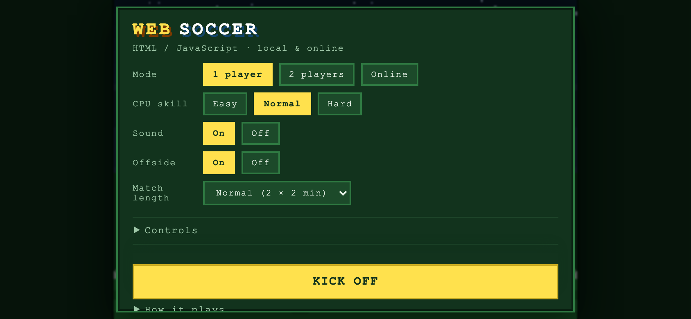
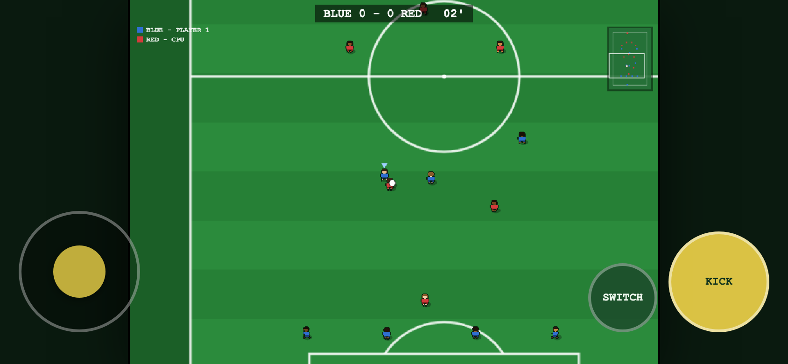

# WebSoccer

Arcade football in the browser, in the spirit of the 16-bit classics: a
vertically scrolling pitch, tiny players, one button, and aftertouch to bend the
ball.

Three ways to play: **1 player against the CPU**, **2 players on one keyboard**,
and **online against each other** using a room code.

No dependencies, no build step. HTML, CSS and JavaScript exactly as the browser
receives them.

**[Play it here](https://markclausing.github.io/websoccer/)** — one and two player
modes run straight from the page. Online multiplayer needs a relay server, which
static hosting cannot provide; see [Playing online](#playing-online).


## Getting started

```bash
git clone https://github.com/markclausing/websoccer.git
cd websoccer
npm start
```

Then open http://localhost:5173/ — that is all. There is no `npm install`; there
are no packages to install.

That single server does two things: serve the page and pair up online matches.
For more detail (a different port, playing over your network or over the
internet, troubleshooting) see [INSTALL.md](INSTALL.md).

Want to help build it? Read [CONTRIBUTING.md](CONTRIBUTING.md) — mostly about why
the simulation has to stay deterministic.


## Controls

|              | Player 1 (blue) | Player 2 (red) |
| ------------ | --------------- | -------------- |
| Move         | `W A S D`       | Arrow keys     |
| Kick / slide | `Space`         | `Enter`        |
| Switch player | `Q`            | `R Shift`      |
| Pause        | `Esc`           | (not online)   |

### On a phone

You get a thumbstick and two buttons on screen instead, and the game asks you to
turn the device sideways — a pitch a few centimetres tall is no use to anyone.
The on-screen controls produce the same input as the keyboard, so nothing else in
the game knows the difference.





#### Fullscreen

On Android the game takes the whole screen when you kick off, address bar and
all. **Safari on iPhone has no fullscreen for a web page** — no page can hide
those bars. What does work is installing it: Share → Add to Home Screen, and it
opens as its own app with nothing around it. The menu says so on an iPhone that
has not installed it yet. There is a web manifest and a set of icons for exactly
this; `node tools/make-icons.js` regenerates them.

### Changing the keys

Those defaults are only defaults: **every key can be changed in the menu**. Click a key
and press the one you want, or pick a preset — arrows and space together, say,
which is a combination the old fixed layout could not give you. Your choice is
remembered in the browser.

Both players may share keys, which is exactly what you want for one player
against the CPU; the menu says so and only stops you starting a two player match
until you have given them separate keys.

Online you control one team and both keyboard halves drive your player. Gamepads
work as well.

How it feels:

- **Tap** for a pass along the ground, **hold** for something harder and higher.
  The bar under your player shows the power; at maximum it fires by itself.
- **Passes are helped along**: aim roughly at a team-mate and the ball bends
  three quarters of the way towards him. A **shot is never touched** - and what
  decides which is which is not how hard you hit it but where you point: if the
  line you are aiming along crosses the goal line inside the posts, it is an
  attempt on goal and the assist keeps out of it. Judging by power would have
  ruined the one kick where accuracy matters most, since a hard flat ball across
  the box is struck exactly like a shot.
- **Aftertouch**: keep steering *after* the kick. Sideways bends the ball, along
  the ball's direction lifts it, against it makes it dip.
- The button **without the ball** is a slide tackle. It carries you about 90
  pixels and you are up again a quarter of a second later.
- You automatically control whoever is nearest the ball. The **switch button
  steps to the next man out** rather than to the nearest, because the automatic
  pick already has you on the nearest 97% of the time - a button that chose him
  again would do nothing. Press it repeatedly to work outwards, and your choice
  stands for a second and a half before the game starts helping again.
- A kicked ball now meets some resistance. A firm shot used to roll on for seven
  and a half seconds and cover 88% of the pitch; it now settles in two and a half
  and covers a little over half.

There are goals, throw-ins, corners, goal kicks, half time and a final whistle,
and **offside** is called (you can switch it off in the menu). No fouls: slide
tackles are free, deliberately, just like the originals.

A few things follow the real rules rather than arcade convention, because they
kept spoiling matches:

- At a kickoff, throw-in, corner or goal kick the opposition **has to stay off
  the ball** until the side taking it has touched it. They drop back rather than
  crowd around it.
- At a kickoff everyone stands **in their own half** and out of the centre circle,
  bar the player taking it.
- Once a **keeper has the ball in his own box**, the opposition backs off instead
  of tackling it out of his hands — for about six seconds. Carry it outside the
  area and he is fair game like anyone else.
- The keeper makes his own saves. You take over the moment he has the ball, so
  the clearance is yours, but you are never dropped into goal just as a shot
  comes in.

## Pace

The whole game runs at 90% speed (`PACE` in `src/constants.js`). It is a single
knob on the clock the physics runs on: the pitch, the shooting ranges and every
timing in ticks stay exactly where they were, so nothing plays differently, it
just gives you more time on the ball. Set it back to 1 if you want the original
tempo.

## The players

They are pixel art: a small figure defined as a grid of characters and coloured
per kit, in `src/render/sprites.js`. Four views - towards you, away, and in
profile either way - with the slide made by turning the profile a quarter, which
is exact for a grid. A dark outline traces the whole figure, without which a blue
shirt on a green pitch at this size is mostly a smudge.

They walk: two frames per view with the legs in different places, swapped over as
the player covers ground rather than on a timer, so the stride speeds up and
slows down with him and stops dead when he does. Only the bottom three rows of
the grid change between frames, which is how it was done when every byte counted.
A slide turns the figure so his head leads the way he is going, with a skid
streaked into the grass behind him - at this size a prone figure and a running
one look too alike, and the streak is what says "slide" at a glance.

The sprites are baked at the zoom the game runs at and then blitted on whole
screen pixels. Drawing them in world space would put their edges on fractions of
a pixel and the resampler would soften away the one thing that makes them pixel
art. The same figure walks around the picture behind the menu.

Each player gets his own skin tone, taken from a palette of six that the eleven
walk through in a stride, hair travelling with it. One tone per team is what it
used to be, and it made the blue side uniformly light and the red side uniformly
dark, which is not what a team looks like. The two sides start at different
points in the palette, so they are not the same eleven faces in different shirts.
The darkest tone is deliberately not the darkest one could go: the face is three
pixels tall seen from above and sits right under the hair, so at the very bottom
of the range a head turned into a single dark blob.

## The title screen

The picture behind the menu is drawn, not loaded: a night match seen from the top
of the stand, painted into a 240 by 166 offscreen canvas and blown up with
smoothing switched off, which is what keeps the pixels square instead of turning
it into a blurred illustration. Floodlight pylons with their glow spilling onto
the sky, a crowd of single pixels placed by a seeded generator so the same faces
sit in the same seats every time, and a pitch tapering away towards the goal.
There are players on it too - the same sprite the match draws, small ones at the
far end where the pitch is narrow and full sized ones near the bottom - along
with the halfway line, centre circle and spot, penalty area, six yard box and
corner arcs. It lives in `src/render/titlescreen.js`.

## The title tune

There is no audio file. The tune on the menu is generated as you listen, with the
Web Audio API: a pulse wave for the melody, a second one running a fast arpeggio,
a triangle bass and filtered noise for the drums — the way the sound chips of the
era did it. It is a few kilobytes of source in `src/audio.js`, no dependency, no
build step, and it is an original piece written in that style rather than a
recreation of any particular game's theme.

It plays on the menu and stops at kickoff, and there is an on/off switch that is
remembered.

During a match the same synthesiser does the effects: the referee's whistle (two
close tones beating against each other with a fast wobble for the pea), boot on
ball (a click of noise over a short thump, harder the harder you hit it), studs
through grass for a slide tackle, and a crowd that swells and falls away when
someone scores. The simulation reports what happened as a list of events each
tick and the sound reacts to those, so it never learns anything about audio. Browsers refuse to make a sound before the visitor has interacted
with the page, so it starts on your first click or key press.

## Line-ups

Under **Line-up** in the menu there is a small pitch with your eleven on it. Pick
one of five shapes — 4-3-3, 4-4-2 diamond, 4-4-2 flat, 3-5-2, 5-3-2 — or drag the
players wherever you want them. Your own goal is at the bottom, so dragging a man
upwards pushes him forward. Both sides can be set: in a one player match the red
buttons are the CPU's shape.

Nobody is labelled a defender or a striker. **Where you put a player is what he
becomes**, read off how far up the pitch he stands: the back band tracks all the
way back, a holding midfielder most of the way, a hanging ten barely at all, a
forward not really. So the diamond's number ten stays high because he is high,
and if you drag him back ten pixels he starts helping out. Your line-up is
remembered between sessions, and in an online match each side plays its own —
the guest declares his on joining and the host puts both in the kickoff message,
so the two machines build identical teams.

A word of warning, since it is measurable. The match was balanced around the
4-3-3, and it turns out to be balanced partly by being *stuck*: with both sides
playing it the ball spends 93% of the match in the middle third. Every other
shape unsticks the game — two central strikers give a long ball somewhere to go —
and CPU against CPU the scorelines run away: a flat 4-4-2 measured 22 goals a
match, 3-5-2 nearly 27. That is finishing being too easy once a side gets
through, which the 4-3-3 hid by rarely getting through, and it is the next thing
worth fixing. Against a defending human the shapes behave themselves and rank the
way you would expect, tightest first: 4-3-3, 5-3-2, 3-5-2, the diamond, and a
flat 4-4-2 leaking twice as much as the rest.


## CPU difficulty

Playing against the CPU you can pick **Easy**, **Normal** or **Hard**. Hard is the
original opponent, untouched; the other two are genuinely weaker rather than just
slower. The yardstick is territory — the share of playing time the ball spends in
the opponent's half — because at roughly two goals a match the scoreline is far
too noisy to tune against. Each level playing HARD comes out at 49% (hard against
itself), 38% (normal) and 30% (easy).

The strongest lever by far is reaction time: an easier CPU chases the ball where
it was a few ticks ago, so it wins possession back far less often. On top of that
they shoot less accurately and from closer in, pass more sloppily, dwell on the
ball, tackle less and run slightly slower.

Your own AI team-mates always play at full strength — handicapping them would
make the game harder for you, not easier. The setting only ever applies to a CPU
team, and `tools/simtest.js` checks that the ladder still holds.


## Room to play

Three numbers, measured while the attacking side has the ball in the final third,
because "it feels crowded" is otherwise impossible to act on:

| | before | now |
| --- | --- | --- |
| nearest defender to the man on the ball | 36 px | 71 px |
| defenders within 70 px of the ball | 1.5 | 0.5 |
| slide tackles per match | 15 | 4 |

The lines now track back by role - defenders all the way, midfielders about half,
forwards barely - so a side under pressure keeps its shape instead of piling
eleven men into its own box, and there is something to pass into.

One thing that looked obviously right and was not: keeping every defender who is
not chasing at least 58 px off the ball. They all ended up standing at exactly
that distance in a ring around the carrier, which crowded him more than before
and dropped scoring to 0.2 goals a match. Spacing the lines apart does the same
job without the ring.

## High scores

Beat the CPU and you are asked for three letters, the way a cabinet asks: stick
up and down for the letter, left and right to move along, kick to confirm.
Typing works too. There is a table of ten per difficulty, and a result gets on it
by margin first, then goals scored, then who got there earliest. A draw counts.
A defeat never does.

By default the table lives in your own browser and needs nothing hosted
anywhere. Point the game at a relay - see below - and it becomes one shared
board instead: your browser sends its table, the server merges it with
everyone's and sends the lot back. Merging is done with the same function on
both sides, and every row carries an id, so a score that has been round three
devices is still one row, and it does not matter who syncs first.

New entries can be announced in a Discord channel - a webhook rather than a bot,
so there is nothing extra to host and no token to keep alive. One secret on the
relay switches it on; see `worker/README.md`. The server decides what to
announce from the board itself, so results that missed the top ten stay quiet and
a score syncing from a second device is not announced twice.

Nothing stops someone posting a result they did not earn; a board with no
accounts on it cannot tell. It refuses defeats and nonsense, caps each table at
ten, and beyond that it trusts the people you gave the address to.


## Playing online

1. Both players open the page from the same server.
2. One picks **Online → OPEN A NEW MATCH** and gets a four-character code. That
   player plays blue.
3. The other enters the code and clicks **JOIN**. They play red.
4. As soon as the second player is in, the match starts for both.

This needs the relay server, so it works when you run the game yourself with
`npm start`. It does **not** work on the GitHub Pages version above: static
hosting cannot keep a WebSocket open. If you do have a relay running somewhere,
point any copy of the page at it by adding `?relay=wss://your-relay` to the URL.

Where this works:

- **Two browser tabs** on one computer (handy for testing).
- **Two computers on the same network**: the second one opens
  `http://<ip-of-the-host>:5173/`. The page automatically connects back to the
  server it came from. Mind your firewall.
- **On Cloudflare, free**: `cd worker && npx wrangler login && npx wrangler deploy`
  puts the same relay on a Worker, and one address then covers both online play
  and the shared high score board. Put it in `src/config.js` as `DEFAULT_RELAY`
  and every visitor uses it without a query string. See `worker/README.md`.
- **Over the internet**: put `server/relay.js` on a server (or tunnel port 5173
  outwards). Behind HTTPS the client switches to `wss://` on its own.

The ping is shown in the bottom left. When you are waiting on your opponent you
get "WAITING FOR OPPONENT" instead of the game guessing.

## Architecture

Everything hangs off one line:

```js
step(state, [maskTeam0, maskTeam1]); // same state + inputs -> always the same result
```

The simulation is pure and deterministic: a fixed 60 Hz timestep, no DOM, no
`Math.random()` (all randomness goes through `state.rng`), and input is nothing
more than a 5-bit mask per player.

That is why online multiplayer needed **no** changes to the simulation. The two
machines only send each other their buttons — never positions, velocities or
scores — and each computes the same match.

```
index.html            menu (local + online) and canvas
styles.css
src/
  constants.js        every dimension, speed and rule constant
  util.js             maths + deterministic PRNG (mulberry32)
  input.js            keyboard/gamepad -> bitmask
  main.js             menu, fixed-timestep game loop
  game/
    state.js          match state, formations, kickoff, clone + hash
    sim.js            step(): the only place where the match changes
    ai.js             CPU logic (runs inside the simulation)
    kick.js           shared kick function for human and CPU alike
  render/
    pitch.js          pitch, drawn once onto an offscreen canvas
    renderer.js       camera, players, ball, HUD, radar, network status
  net/
    signal.js         WebSocket client: rooms and message routing
    transport.js      LocalTransport (local) and OnlineTransport (lockstep)
server/
  relay.js            static files + rooms + passing inputs along
  ws.js               WebSocket protocol by hand (no dependencies)
tools/
  simtest.js          headless match + determinism check
  netcheck.js         two real players against each other through the real server
  uicheck.js          main.js against a fake DOM, including the online flow
```

### Where the layers meet

- **Rendering only reads.** The renderer never writes to `state`. Camera
  smoothing and screen shake sit outside the simulation on purpose: cosmetics may
  differ per machine, the match may not.
- **Input is an integer.** The game loop only knows `sample(tick)`,
  `ready(tick)`, `poll(tick)` and `afterStep(state)`. Local and online implement
  the same four methods; the loop has no idea which one it is talking to.
- **The AI lives inside the simulation.** Otherwise two machines would make
  different CPU decisions and drift apart immediately.
- **One tick is three phases.** First all 22 players decide their intent from the
  same snapshot, then kicks are carried out, then everyone moves. Without that
  split, team 1 reacts to fresh positions and team 0 to stale ones — which
  measurably won team 1 more goals (114 to 66 across 60 CPU matches, now 74 to
  62).

### How the netcode works

**Lockstep with input delay.** The input for tick T is sent a number of ticks
ahead of time so it arrives before it is needed. If it is not there anyway, the
simulation waits (a "stall") instead of guessing — which is why the two sides
cannot drift apart.

- **Identical start.** The host picks the seed and sends it along; both sides run
  `createMatch({ seed, humans: [true, true] })`.
- **Packet loss repairs itself.** Every message carries the last eight ticks of
  input, so nothing ever has to be re-requested.
- **The delay adapts.** Frequent stalls push it up (to 12 ticks); a calm
  connection brings it back down (to 3). This may differ per player: every input
  carries its own tick number, so the outcome stays the same. The network test
  shows exactly that — the two sides finish on a different delay and still agree
  on the match.
- **Desync detection.** Once a second a `hashState()` goes back and forth. If
  they differ the match stops with a clear message, rather than letting the two
  players quietly play different matches.
- **The server is dumb.** It pairs two players by code and passes messages along.
  It does not know the rules and keeps no score.

Keep to these rules when extending things, or determinism goes out of the window:

- no `Math.random()` in `src/game/**` (use `randRange(state, ...)`);
- no `Date.now()` or `performance.now()` in the simulation;
- no iteration over `Set`/`Object.keys()` whose order can vary;
- rendering must never write to `state`.

## Screenshots

The pictures above are taken by `node tools/screenshot.js`, with the local server
running. It starts Chrome headless and drives it over the DevTools protocol,
which node can speak with its built-in WebSocket - no puppeteer, no dependency.
It clicks through the menu, holds a key so the human side actually plays, and
waits for the ball to reach a goalmouth before pressing the shutter, so what you
see is the real page rendering a real match rather than a mock-up.

## Tests

```bash
npm test           # all three
npm run test:sim   # plays whole matches headless, checks determinism
npm run test:net   # starts the relay, connects two real clients, plays 100s and
                   # checks both sides compute the same match
npm run test:ui    # runs main.js against a fake DOM: menu, local match, opening
                   # an online match, an opponent joining, playing, and handling
                   # an opponent who disappears
```

When digging into network behaviour: `__game.transport` in the browser console
gives you `ping`, `delay`, `stalls` and `desync`.

## What is not there yet

- No fouls, free kicks or penalties. A slide that takes the man and misses the
  ball is simply a good tackle here, which is the single biggest thing the
  referee is missing — offside he does call.
- Two teams, BLUE and RED, and no league, cup or season around the match.
  Line-ups can be changed, kits cannot.
- The match is balanced around the 4-3-3 and it shows: every other shape opens
  the game up and CPU against CPU the scorelines run away, because finishing is
  too easy once a side gets through. See the note under **Line-ups**. Fixing that
  is worth more than any new feature on this list.
- The keeper is simple: he walks to the ball and hoofs it clear, he does not dive.
- No commentary, no net ripple, and the crowd only reacts to goals — there is no
  ambience in between.
- Nobody checks that a high score is real. Anyone who can read `src/highscores.js`
  can post a result they did not earn, and a board with no accounts on it cannot
  tell the difference.
- Online: no rematch button (back to the menu and start again), no reconnecting
  after a drop, and messages go over the wire as JSON. Around 4 kB/s per player —
  fine, but binary would be considerably leaner.
- Everything runs through the relay server. WebRTC (peer to peer) would lower
  latency; the relay would still be needed to introduce the two players.
- Discord only ever gets told about new entries. It cannot be asked anything,
  which would need a real bot rather than a webhook.

Fancy picking one of these up? [CONTRIBUTING.md](CONTRIBUTING.md) describes where
to start per topic.

## Licence

[MIT](LICENSE).

This is an original tribute to the top-down football games of the nineties. The
project stands on its own: no code, artwork or other parts of any existing game,
and no affiliation with their makers or rights holders.
