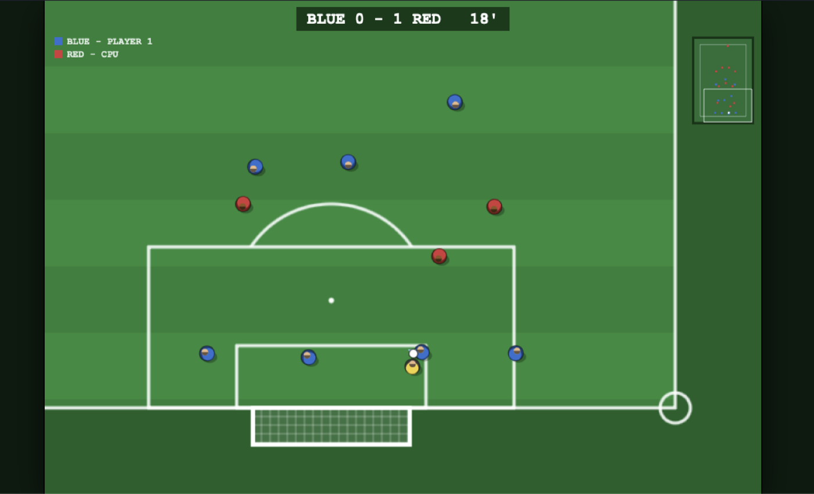
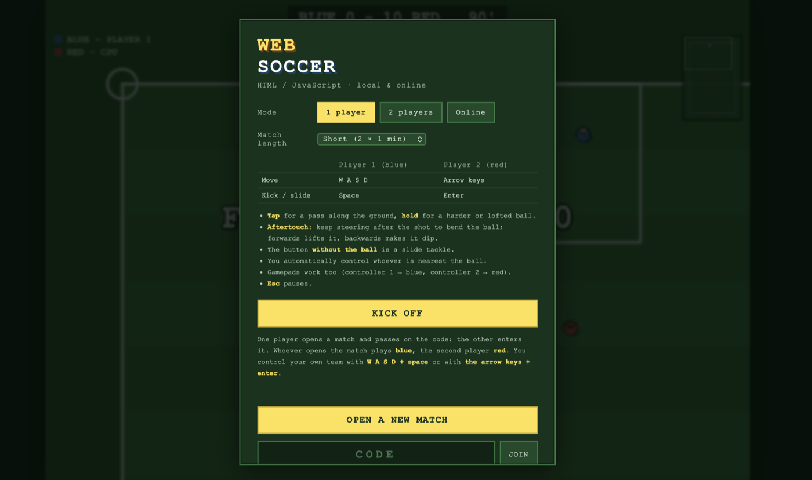
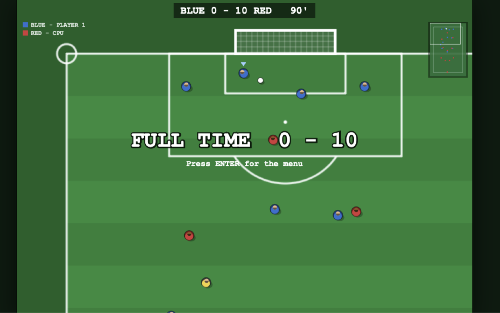

# WebSoccer

Arcade football in the browser, in the spirit of the 16-bit classics: a
vertically scrolling pitch, tiny players, one button, and aftertouch to bend the
ball.

Three ways to play: **1 player against the CPU**, **2 players on one keyboard**,
and **online against each other** using a room code.

No dependencies, no build step. HTML, CSS and JavaScript exactly as the browser
receives them.

**[Play it here](https://markclausing.github.io/websoccer/)** — one and two player
modes run straight from the page. Online multiplayer needs a relay server, which
static hosting cannot provide; see [Playing online](#playing-online).



## Getting started

```bash
git clone https://github.com/markclausing/websoccer.git
cd websoccer
npm start
```

Then open http://localhost:5173/ — that is all. There is no `npm install`; there
are no packages to install.

That single server does two things: serve the page and pair up online matches.
For more detail (a different port, playing over your network or over the
internet, troubleshooting) see [INSTALL.md](INSTALL.md).

Want to help build it? Read [CONTRIBUTING.md](CONTRIBUTING.md) — mostly about why
the simulation has to stay deterministic.



## Controls

|              | Player 1 (blue) | Player 2 (red) |
| ------------ | --------------- | -------------- |
| Move         | `W A S D`       | Arrow keys     |
| Kick / slide | `Space`         | `Enter`        |
| Pause        | `Esc`           | (not online)   |

Those are only the defaults: **every key can be changed in the menu**. Click a key
and press the one you want, or pick a preset — arrows and space together, say,
which is a combination the old fixed layout could not give you. Your choice is
remembered in the browser.

Both players may share keys, which is exactly what you want for one player
against the CPU; the menu says so and only stops you starting a two player match
until you have given them separate keys.

Online you control one team and both keyboard halves drive your player. Gamepads
work as well.

How it feels:

- **Tap** for a pass along the ground, **hold** for something harder and higher.
  The bar under your player shows the power; at maximum it fires by itself.
- **Aftertouch**: keep steering *after* the kick. Sideways bends the ball, along
  the ball's direction lifts it, against it makes it dip.
- The button **without the ball** is a slide tackle.
- You automatically control whoever is nearest the ball.

There are goals, throw-ins, corners, goal kicks, half time and a final whistle,
and **offside** is called (you can switch it off in the menu). No fouls: slide
tackles are free, deliberately, just like the originals.

A few things follow the real rules rather than arcade convention, because they
kept spoiling matches:

- At a kickoff, throw-in, corner or goal kick the opposition **has to stay off
  the ball** until the side taking it has touched it. They drop back rather than
  crowd around it.
- Once a **keeper has the ball**, the opposition backs off instead of tackling it
  out of his hands — but only for about six seconds, after which they may close
  him down again.
- The keeper makes his own saves. You take over the moment he has the ball, so
  the clearance is yours, but you are never dropped into goal just as a shot
  comes in.

## Pace

The whole game runs at 90% speed (`PACE` in `src/constants.js`). It is a single
knob on the clock the physics runs on: the pitch, the shooting ranges and every
timing in ticks stay exactly where they were, so nothing plays differently, it
just gives you more time on the ball. Set it back to 1 if you want the original
tempo.

## CPU difficulty

Playing against the CPU you can pick **Easy**, **Normal** or **Hard**. Hard is the
original opponent, untouched; the other two are genuinely weaker rather than just
slower. The yardstick is territory — the share of playing time the ball spends in
the opponent's half — because at roughly two goals a match the scoreline is far
too noisy to tune against. Each level playing HARD comes out at 49% (hard against
itself), 38% (normal) and 30% (easy).

The strongest lever by far is reaction time: an easier CPU chases the ball where
it was a few ticks ago, so it wins possession back far less often. On top of that
they shoot less accurately and from closer in, pass more sloppily, dwell on the
ball, tackle less and run slightly slower.

Your own AI team-mates always play at full strength — handicapping them would
make the game harder for you, not easier. The setting only ever applies to a CPU
team, and `tools/simtest.js` checks that the ladder still holds.



The CPU does not hold back.

## Playing online

1. Both players open the page from the same server.
2. One picks **Online → OPEN A NEW MATCH** and gets a four-character code. That
   player plays blue.
3. The other enters the code and clicks **JOIN**. They play red.
4. As soon as the second player is in, the match starts for both.

This needs the relay server, so it works when you run the game yourself with
`npm start`. It does **not** work on the GitHub Pages version above: static
hosting cannot keep a WebSocket open. If you do have a relay running somewhere,
point any copy of the page at it by adding `?relay=wss://your-relay` to the URL.

Where this works:

- **Two browser tabs** on one computer (handy for testing).
- **Two computers on the same network**: the second one opens
  `http://<ip-of-the-host>:5173/`. The page automatically connects back to the
  server it came from. Mind your firewall.
- **Over the internet**: put `server/relay.js` on a server (or tunnel port 5173
  outwards). Behind HTTPS the client switches to `wss://` on its own.

The ping is shown in the bottom left. When you are waiting on your opponent you
get "WAITING FOR OPPONENT" instead of the game guessing.

## Architecture

Everything hangs off one line:

```js
step(state, [maskTeam0, maskTeam1]); // same state + inputs -> always the same result
```

The simulation is pure and deterministic: a fixed 60 Hz timestep, no DOM, no
`Math.random()` (all randomness goes through `state.rng`), and input is nothing
more than a 5-bit mask per player.

That is why online multiplayer needed **no** changes to the simulation. The two
machines only send each other their buttons — never positions, velocities or
scores — and each computes the same match.

```
index.html            menu (local + online) and canvas
styles.css
src/
  constants.js        every dimension, speed and rule constant
  util.js             maths + deterministic PRNG (mulberry32)
  input.js            keyboard/gamepad -> bitmask
  main.js             menu, fixed-timestep game loop
  game/
    state.js          match state, formations, kickoff, clone + hash
    sim.js            step(): the only place where the match changes
    ai.js             CPU logic (runs inside the simulation)
    kick.js           shared kick function for human and CPU alike
  render/
    pitch.js          pitch, drawn once onto an offscreen canvas
    renderer.js       camera, players, ball, HUD, radar, network status
  net/
    signal.js         WebSocket client: rooms and message routing
    transport.js      LocalTransport (local) and OnlineTransport (lockstep)
server/
  relay.js            static files + rooms + passing inputs along
  ws.js               WebSocket protocol by hand (no dependencies)
tools/
  simtest.js          headless match + determinism check
  netcheck.js         two real players against each other through the real server
  uicheck.js          main.js against a fake DOM, including the online flow
```

### Where the layers meet

- **Rendering only reads.** The renderer never writes to `state`. Camera
  smoothing and screen shake sit outside the simulation on purpose: cosmetics may
  differ per machine, the match may not.
- **Input is an integer.** The game loop only knows `sample(tick)`,
  `ready(tick)`, `poll(tick)` and `afterStep(state)`. Local and online implement
  the same four methods; the loop has no idea which one it is talking to.
- **The AI lives inside the simulation.** Otherwise two machines would make
  different CPU decisions and drift apart immediately.
- **One tick is three phases.** First all 22 players decide their intent from the
  same snapshot, then kicks are carried out, then everyone moves. Without that
  split, team 1 reacts to fresh positions and team 0 to stale ones — which
  measurably won team 1 more goals (114 to 66 across 60 CPU matches, now 74 to
  62).

### How the netcode works

**Lockstep with input delay.** The input for tick T is sent a number of ticks
ahead of time so it arrives before it is needed. If it is not there anyway, the
simulation waits (a "stall") instead of guessing — which is why the two sides
cannot drift apart.

- **Identical start.** The host picks the seed and sends it along; both sides run
  `createMatch({ seed, humans: [true, true] })`.
- **Packet loss repairs itself.** Every message carries the last eight ticks of
  input, so nothing ever has to be re-requested.
- **The delay adapts.** Frequent stalls push it up (to 12 ticks); a calm
  connection brings it back down (to 3). This may differ per player: every input
  carries its own tick number, so the outcome stays the same. The network test
  shows exactly that — the two sides finish on a different delay and still agree
  on the match.
- **Desync detection.** Once a second a `hashState()` goes back and forth. If
  they differ the match stops with a clear message, rather than letting the two
  players quietly play different matches.
- **The server is dumb.** It pairs two players by code and passes messages along.
  It does not know the rules and keeps no score.

Keep to these rules when extending things, or determinism goes out of the window:

- no `Math.random()` in `src/game/**` (use `randRange(state, ...)`);
- no `Date.now()` or `performance.now()` in the simulation;
- no iteration over `Set`/`Object.keys()` whose order can vary;
- rendering must never write to `state`.

## Tests

```bash
npm test           # all three
npm run test:sim   # plays whole matches headless, checks determinism
npm run test:net   # starts the relay, connects two real clients, plays 100s and
                   # checks both sides compute the same match
npm run test:ui    # runs main.js against a fake DOM: menu, local match, opening
                   # an online match, an opponent joining, playing, and handling
                   # an opponent who disappears
```

When digging into network behaviour: `__game.transport` in the browser console
gives you `ping`, `delay`, `stalls` and `desync`.

## What is not there yet

- No fouls, free kicks, penalties or offside.
- One formation (4-3-3) and two teams; no team selection or league yet.
- The keeper is simple: he walks to the ball and hoofs it clear, he does not dive.
- No sound.
- Online: no rematch button (back to the menu and start again), no reconnecting
  after a drop, and messages go over the wire as JSON. Around 4 kB/s per player —
  fine, but binary would be considerably leaner.
- Everything runs through the relay server. WebRTC (peer to peer) would lower
  latency; the relay would still be needed to introduce the two players.

Fancy picking one of these up? [CONTRIBUTING.md](CONTRIBUTING.md) describes where
to start per topic.

## Licence

[MIT](LICENSE).

This is an original tribute to the top-down football games of the nineties. The
project stands on its own: no code, artwork or other parts of any existing game,
and no affiliation with their makers or rights holders.
